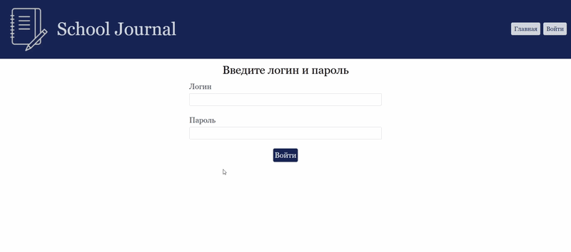
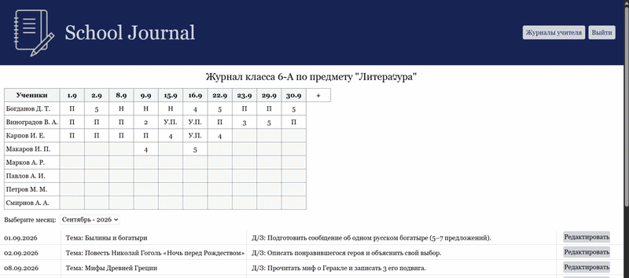
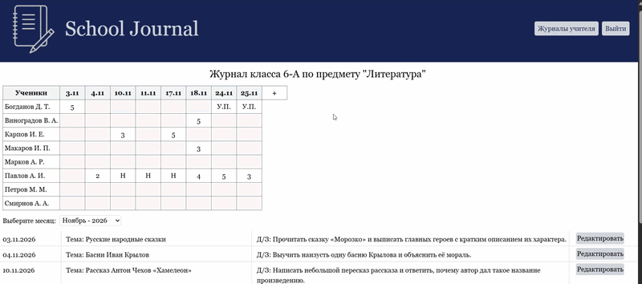
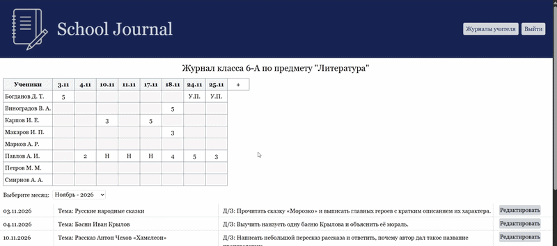
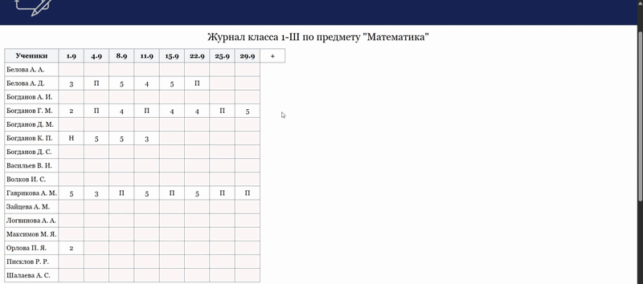

# School Journal

Веб-приложение электронного школьного журнала, разработанное с использованием ASP.NET Core и Vue.js.

## Стек технологий
- ASP.NET Core
- EF Core
- MS SQL Server
- Vue.js

## Архитектура

Приложение состоит из двух REST API сервисов:

- Сервис аутентификации и авторизации
- Сервис бизнес-логики приложения

Клиентская часть реализована на Vue.js и взаимодействует с API через HTTP-запросы.

## Бизнес-функции

### Роли пользователей
- Неавторизованный пользователь
- Администратор
- Учитель
- Ученик

### Неавторизованный пользователь
- Авторизация

### Общий функционал авторизованных пользователей
- Просмотр журнала класса
- Просмотр статистики успеваемости ученика
> Ученик имеет доступ только к собственной успеваемости.

### Функции администратора
- Просмотр списка пользователей
- Фильтрация пользователей по ролям
- Поиск пользователей по ФИО
- Добавление, удаление и редактирование пользователей
> Удаление пользователя невозможно, если он является учеником, который состоит в классе или учителем, который на данный момент преподаёт один из предметов
- Перевод ученика из класса в класс
- Назначение предметов учителям
- Просмотр списка классов
- Фильтрация классов по уровню образования
- Добавление, удаление и редактирование классов
> Удаление класса невозможно, пока с ним связан хотя бы один ученик или журнал
- Просмотр журналов для выбранного класса
- Добавление и удаление журналов
> Удаление журнала невозможно, если в журнале уже есть данные об успеваемость или уроки

### Функции учителя
- Просмотр списка текущих журналов
- Редактирование успеваемости ученика
> Учитель может редактировать успеваемость ученика в течение 30 дней со дня проведения урока. История изменений отображается при выборе соответствующей ячейки журнала.
- Добавление и удаление уроков из журнала
> Удаление урока невозможно после даты его проведения или при наличии связанной успеваемости.
- Редактирование темы урока и домашнего задания
> Редактирование урока невозможно, если он уже был проведён

## Демонстрация работы приложения
### Авторизация 

    

### Просмотр страниц журнала

    

### Добавление/Удаление урока

    

### Редактирование успеваемости

    

### Просмотр статистики ученика

    

